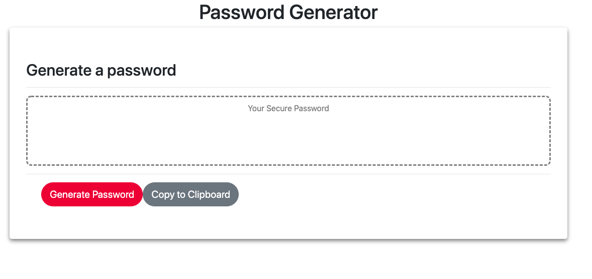

# Password Generator
This application is a random password generator based on different character types that the user picks. Users have the choice from special, numeric, upper case, and lower case characters. They can decide for their password to contain as many of the character types as they want, but they have to pick at least one type. The password length must be between 8-128 characters, or the generator will not make a password. There is also a button on the application that copies the password to the clipboard. 

## Screenshot 


## Built With

* [HTML](https://developer.mozilla.org/en-US/docs/Web/HTML): used for structuring and creating elements on the DOM
* [CSS](https://developer.mozilla.org/en-US/docs/Web/CSS): used to style html elements on the page
* [JavaScript](https://developer.mozilla.org/en-US/docs/Web/JavaScript): used to create responsive, interactive elements on the page

## Deployed Link

* [See Live Site](https://xrachhel.github.io/passwordGenerator/)

## Code snippet 
```html
if (special === true && number === false && lowerCase === false && upperCase === false){
    function makepassword(length) {
        var result           = "";
        var characters       = "!#$%&^@*()+-_{}[]`~/|<>";
        var charactersLength = characters.length;
        for ( var i = 0; i < length; i++ ) {
           result += characters.charAt(Math.floor(Math.random() * charactersLength));
        }
        return result;
     }
     
     document.getElementById("userpass").textContent = makepassword(userLength);
}
```
Conditional statements are  used to create the password based on the different character types the user picks. Depending on how many character types the user picks, this information is set as a string into a variable, which is then iterated through based on the the length the user asked for using the math.random function in javascript. 

## Authors

Rachel Yeung 

- [Portfolio](https://rachelyeung.herokuapp.com/)
- [Github](https://github.com/xrachhel/passwordGenerator)
- [LinkedIn](https://www.linkedin.com/)
